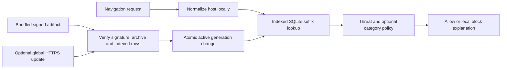

# Local Guard classification and filter packs

Wingman Guard evaluates destinations locally. Normal navigation does not send
its URL, hostname, selected categories, or page contents to a Wingman classifier.
The shipped global starter has 49 manually authored records with limited
coverage; its malware, phishing, and harmful-download records are reserved
synthetic fixtures. Native browser security checks remain separate. A category
is a destination classification, not a guarantee about every page on a website.

`GuardRuntime.initialize()` opens a dedicated `guard.db`. On iOS it uses the
app's protected Application Support directory; on Android it uses the app's
private database directory. The web companion uses SQLite over IndexedDB on its
origin and does not embed a website engine. Only a verified native database path
is handed to the platform engines. Failure leaves the evidence intact, reports
an unavailable status, and allows the ordinary browser to start. The local
custom block and focus-host policies remain usable when the pack is unavailable;
category protection cannot be promised in that degraded state.

`DomainNormalizer` removes case/trailing-dot differences, rejects credentials,
unsupported schemes and ambiguous numeric IP forms, and uses canonical IPv6
keys. Unicode and ACE labels go through the native/browser IDNA implementation;
unsupported input is rejected rather than silently treated as an unmatched
Unicode domain. Unit tests inject only the platform conversion boundary, while
native integration tests exercise actual platform normalization. Suffix matching
requires a label boundary, uses IP addresses exactly, and never queries a
multi-label hostname's top-level suffix alone.

Policy checks signed malware and phishing rules first, and signed harmful
download rules for download requests. These cannot be overridden. It then
checks custom blocks and executable file-type/MIME cautions. An unlocked,
controller-validated Allow Once grant or a custom allow rule can exempt optional
category rules. Focus adds temporary categories/hosts without changing lifestyle
selections. Curated support destinations exempt category matches only; they do
not exempt threats, custom blocks, or download checks. Private requests receive
the same decisions and bypass the in-memory hostname cache. No browsing history
or per-URL decision log exists in `guard.db`.

SafeSearch is applied locally when Adult filtering is active. Recognized
DuckDuckGo, Google `.com`, Bing, and Brave GET search destinations receive their
strict parameters; DuckDuckGo and Brave also use their public safe search hosts.
Search text, duplicate unrelated parameters and fragments are preserved. Known
HTTP search requests upgrade to HTTPS. Other providers, regional Google domains,
provider-specific POST searches, and every possible search interface are not
claimed to be covered. SafeSearch reduces explicit results and cannot guarantee
that every linked destination is appropriate.

## Signed distribution contract

A manifest envelope contains `keyId`, `payload` (base64), and `signature`
(base64). Ed25519 verifies the exact payload bytes, avoiding cross-language JSON
serialization ambiguity. The signed payload specifies schema 1, release version,
monotonic integer sequence, UTC creation time, minimum app version, and one
global artifact. This single artifact prevents category selection from being
revealed through category-specific download URLs. It pins filename, byte length,
rule count, license, archive SHA-256, and `rulesSha256`.

Each NDJSON record has a canonical ASCII host, stable rule ID, rule kind,
category, and explicit subdomain flag. Valid kinds are `category`, `support`,
`malware`, `phishing`, and `harmful-download`; the threat kind/category pairing is
validated. Duplicate index keys, malformed records, excess counts, and invalid
signatures/checksums abort the transaction. The active and previous successful
releases are retained. Incoming sequences must exceed the high-water mark;
explicit rollback to the previous verified release does not lower that mark.

The signed index digest is SHA-256 over rows sorted by `(host, kind, category)`.
For each row, hash UTF-8 `jsonEncode([host, kind, category,
include_subdomains, rule_id])` plus a newline. `include_subdomains` is integer
0 or 1 and absent support category is the empty string. SQLite keyset batches
of 500 rows reproduce the digest on import, startup, and rollback. The archived
signed bytes alone are not treated as proof that an existing index is intact.
A bad active index can recover a verified previous generation without deleting
the damaged release; with no verified release, native pack lookup stays disabled.

The schema shared by Dart, Android SQLite, and iOS SQLite3 is:

| Table | Purpose |
| --- | --- |
| `guard_state` | One row (`id=1`), active/previous generation, active version, highest sequence, last update check |
| `guard_releases` | Signed envelope and artifact blobs plus release metadata |
| `guard_rules` | `WITHOUT ROWID`, primary key `(generation, host, kind, category)`, subdomain flag and rule ID |

Native navigation joins `guard_rules` to `guard_state.active_generation` in the
same indexed query so a committed update cannot expose a partial generation.
The normal Dart cache is bounded to 512 hosts for ten minutes and cleared on
pack changes. See [the measured 100,000-rule benchmark](GUARD_PERFORMANCE.md).

## Optional updates and key handling

No remote source is configured at startup. Bundled rules function offline and
there is no fallback cloud classifier. `HttpsFilterPackUpdateSource` is an
optional transport implementation for a reviewed future deployment: a fixed
HTTPS `manifest.json` URL, same-directory signed artifact filenames, no
redirects, bounded streamed responses, and a 60-second transfer deadline. The
web implementation omits credentials and referrers. TLS validation is never
bypassed. A persisted 24-hour cadence bounds automatic checks; explicit user
checks can bypass the cadence. Network or validation failure keeps the current
verified generation. A pack older than 30 days is shown as stale but remains
usable offline. Actual production-hosted update service availability is unverified.

The importer limits the envelope to 64 KiB, artifact to 64 MiB, and release to
500,000 rules. Startup verifies the index once; routine navigation uses bounded
suffix lookups. Imports decode records in chunks and retain artifact bytes
within the configured limit, so update peak memory exceeds steady navigation.

`assets/guard/public_keys.json` contains a development verification key. Its
signing seed is outside the repository and app assets. Test keys are independent
and never trusted by the app. `tool/guard/build_starter_pack.dart` authors the
limited CC0 starter using an external development key. A production distribution
requires its own protected signing key, reviewed/licensed coverage, deployment
ownership, and a real configured endpoint. This is not a production threat feed
or an anti-tampering guarantee against an owner who controls the app/device.
