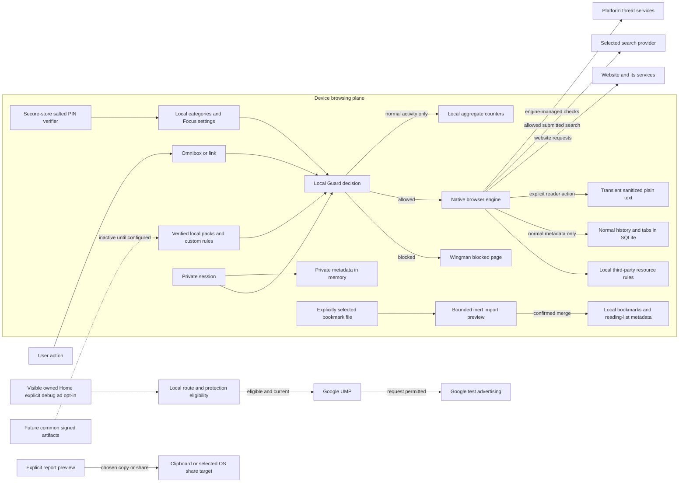

# Browser privacy architecture

**We've got your back, not your data.** Wingman Guard makes ordinary navigation decisions from local policy and local filter data. It does not send the destination to a Wingman classification server. Security threat protection, voluntary category controls and tracking-resource blocking remain separate systems.

This document describes the application data boundaries and network inventory. It is not a substitute for the eventual operator's published privacy policy or final store disclosures. Historical Phase 2 evidence is retained below; current changes and observed checks are recorded in [Phase 3 status](PHASE_3_STATUS.md). Undocumented remote services are not implied by future architecture notes.

## Data flow

The public-artifact connection is inactive. The report composer exports only after a separate copy/share action; it has no connected reporting inbox. Neither is a browsing proxy. Google ad/consent SDK traffic is separate from browser history and is not processed by the browser's tracker-rule adapter. Private browsing uses the same chosen Guard controls while retaining its separate storage boundaries.

## What stays local

| Data | Storage/retention | User control |
| --- | --- | --- |
| Normal history | SQLite, most recent visit per URL; up to 90 days and 5,000 URLs | Clear history |
| Bookmarks and normal tabs | Separate SQLite tables until removed | Explicit add/remove/close |
| Reading list | Local SQLite v2: title, URL, created/read dates only; maximum 500 | Explicit normal-page save, read/unread and remove; no private-page save, offline page archive or cloud sync |
| Bookmark import/export | User-selected Netscape HTML; inert bounded preview; explicit merge/export | Import ≤2 MiB/5,000 candidates; duplicate/cap recheck before commit. Exports disclose full URLs; chosen files and OS share caches may remain outside Wingman |
| Reader text | Bounded visible article text in memory while the route exists | User-invoked local extraction, source attribution, no page-body database, cloud processing, remote-image loading or active HTML |
| Private history/tab metadata | No persistent history or tab writes; in-memory metadata | Close private tab/session |
| Guard categories, custom rules and Focus settings | Browser SQLite settings, separate from browsing-event tables | Settings; protected mutations require PIN when configured |
| Signed filter packs | Local indexed data; retain previous valid pack for rollback | Last valid data remains useful offline; no per-navigation cloud query |
| PIN credential | Platform secure storage; salted derived verifier, never plaintext PIN | Explicit create/change/remove with current authorization |
| Local suggestions | History/bookmark matching on device | No upload of omnibox keystrokes; private behavior is stricter |
| Blocking summary | Current local day plus three scalar totals in browser SQLite settings; no URL, domain, or per-event timestamp | Reset statistics; private activity is excluded from saved counters |

The Dart domain-lookup cache is memory-only, bounded to 512 hosts and ten minutes. Private requests bypass both reading and adding to that cache. Native rule adapters perform read-only queries over the public filter data and retain no lookup history. Temporary allow-once grants are per tab and expire after five minutes or a completed navigation; temporary tracking exceptions stay in memory until restart. An explicit always-allow/custom-rule action saves a preference even if initiated from a private tab; it is distinct from automatic private history/counter recording.

Normal local databases are not application-level encrypted by Wingman. Android app backup is disabled; iOS structured browser storage is under backup-excluded Application Support. This does not establish the backup or erasure behavior of every normal WebKit file, previous OS backup, user download or exported item. SQLite secure deletion does not promise erasure from snapshots.

Private iOS pages use a nonpersistent WK data store configured before view creation. Android private pages use independent profiles and can temporarily write isolated site data to disk; close/eviction clears it and next launch removes abandoned profiles. Websites, network providers and OS services can still observe traffic they handle. See [Phase 1 storage detail](PRIVACY.md).

## Phase 3A local-data and screen boundaries

The reading list is metadata, not an offline content downloader. Save-current-page validates the source tab again before saving and rejects private/Home pages. Reading list → Add address also permits a validated, explicit HTTP(S) address from normal Home without visiting it; the action is unavailable in private mode. Confirmed library changes are serialized and visible only after a successful storage operation, preventing a misleading imported/saved success. Schema v2 adds the reading-list table while preserving v1 tables and preferences. Website-size preferences remain local.

Bookmark parsing has no WebView, JavaScript runtime, URL fetcher or other-browser database access. A file chooser selection is the only import source. The HTML parser receives bounded UTF-8 Netscape exports; markup depth/tag/candidate limits precede parsing. URLs must be credential-free HTTP(S), titles are bounded plain text and export fields are escaped. Previewing never navigates. Export is a separate disclosure/confirmation followed by the OS destination chooser or web file download; Wingman cannot promise erasure of the resulting file or external share cache.

Reader is an explicit local action on the current native page. It extracts visible article/main text, excluding scripts, form controls, editable content, hidden nodes, embedded frames and non-article chrome, with output/work limits. No credentials are read through JavaScript. It does not remove overlays, unhide content, bypass access checks or use an off-device summarizer. A changed/closed navigation invalidates the result. Flutter renders plain text and the source address, with no active links/images/HTML. The underlying website may continue its ordinary activity; reader mode is not a claim to terminate all website connections.

Android uses app-window capture protection from activity creation; screenshots, recording and screen sharing of Wingman are restricted throughout the app, including ordinary pages. This conservative baseline avoids a transition frame exposing a private tab or PIN. iOS places an opaque native cover over inactive scenes for OS previews. It does **not** prevent a user taking a screenshot while actively using the iOS app. These controls are distinct from private storage isolation. Exact native checks and HTTP-auth/autofill/passkey limits belong in the [platform matrix](PLATFORM_CAPABILITY_MATRIX.md).

Reader availability in 3A is **iOS only**, using an isolated WK content world. Android's installed WebView/AndroidX combination does not provide the reviewed isolated execution boundary required here; its Reader action is disabled. There is no shared-page-world JavaScript fallback. Explicit reading-list metadata and native text sizing remain available. This gate also avoids trusting website-overridden DOM functions to enforce exclusion of hidden/form content.

Guard settings are passed to monetization only as a local coarse capability requirement, never a category, host, URL or inferred characteristic. Unknown/strict requirements withhold the unverified provider before UMP/SDK work. Live state checks and synchronous notifications invalidate attempts on private/Guard changes before the next UI frame, as well as on route and lifecycle changes. No new interests or inventory are added in 3A. [Monetization policy](MONETIZATION_POLICY.md)

## Network inventory

Application-created flows, with Phase 3A local additions above and historical Phase 2 destinations retained:

| Destination | Trigger and payload | Recipient/retention | Optionality |
| --- | --- | --- | --- |
| User's HTTP(S) destination, including redirects/resources | Allowed browser navigation or explicit download | Website and its service providers receive normal requests; their retention applies | Initiated by browsing; Guard may block before navigation |
| `https://duckduckgo.com/`, `https://safe.duckduckgo.com/` | Submitted search query, provider-specific safe-search setting when applicable | DuckDuckGo; provider policy | Selected search provider; no keystroke upload |
| `https://www.google.com/search` | Submitted query and applicable provider safe-search parameters | Google Search; provider policy | Selected provider |
| `https://www.bing.com/search` | Submitted query and applicable provider safe-search parameters | Microsoft Bing; provider policy | Selected provider |
| `https://search.brave.com/search`, `https://safe.search.brave.com/search` | Submitted query and applicable provider safe-search parameters | Brave Search; provider policy | Selected provider |
| `https://www.wikipedia.org`, `https://www.youtube.com`, `https://openai.com` | Explicit Home quick-link tap; ordinary navigation | Chosen website; website policy | Optional shortcuts |
| OS share target, email/phone/SMS app or host browser | Explicit share/external action; selected address or content | Selected external app; its policy | User-confirmed/export action |
| Google UMP/Google Mobile Ads SDK-selected services | Debug-only flag plus Home opt-in, consent checks and approved test ad request; technical SDK data | Google; applicable SDK/provider retention, not a Wingman-defined retention promise | Disabled by default and in production builds |
| Platform-managed Safe Browsing/fraudulent-site services | Native browser protection according to provider/OS behavior | Platform service providers; provider policy | Native security remains enabled where supported |
| Companion's serving origin | Flutter/app/font/WASM/worker assets | Local development server or a future explicitly deployed host | Needed to load the web companion |
| Wingman filter/config/report servers | **No active endpoint** | No resources/deployment or request receiver established in Phase 2 | Future separate configuration/action |
| Wingman sync/AI/account services | **No active endpoint or SDK** | No configured Browser backend or deployed resource; no page, library or Guard data transmitted | Deferred; [sync gate](SYNC_SECURITY_DESIGN.md) |

`lib/domain/search.dart` centralizes search/quick-navigation destinations; `lib/browser/browser_engine.dart` and native handlers create browsing/download requests. `lib/domain/local_suggestions.dart` has no remote suggestion request. PIN/cryptographic code has no network dependency. The tracker list's provenance URLs are metadata, not startup fetches. Runtime browser pages can contact additional servers chosen by those pages; this inventory is not a claim that arbitrary websites use only the listed hosts.

SDK and OS service hosts are not hard-coded by Wingman's request layer. Their exact endpoint set and retention must be measured/reviewed for the release SDK, OS, region and consent state. A source audit cannot honestly invent a complete dynamic Google/WebKit host inventory. The [provider review](PHASE2_PROVIDERS.md) and [ad privacy disclosures](PRIVACY.md) describe those separate responsibilities.

## Trust and consent boundaries

The browser's application channel is not exposed as an unrestricted website-native API. TLS errors are cancelled. Custom allow rules and “Allow once” must never bypass invalid certificates or mandatory threat policy. Tracker-breakage exceptions must affect only tracking-resource policy. Monetization cannot exempt a commercially valuable destination from Guard.

Guard decisions use normalized domains and indexed local packs, not page-text keyword classification or AI page uploads. Unknown domains are not evidence of safety or a known content category. Support/recovery exceptions are explicit local rules and do not make classification perfect.

Filter activation verifies signed metadata, the source-file digest and a signed digest of canonical indexed rows before use, and retains a previous valid version. Startup checks the persisted index against that signed digest. An unreadable or unverified Guard store exposes no native database path and reports unavailable coverage while ordinary browsing and native security remain usable. No production signing private key belongs in the application. A cloud operator could see ordinary update request metadata if remote distribution is later enabled; common global bundles reduce the risk of disclosing selected sensitive categories through named pack downloads. [Cloud control-plane design](CLOUD_CONTROL_PLANE.md)

A false-classification report must show the exact proposed content before any export/submission. The full original browsing URL is not silently attached. A local report composer is not a deployed report service or a guarantee that an operator received a report.

## Source audit and verification scope

Review targets are application Dart, app-owned native code, configured SDKs, bundled filter provenance, native plugin extensions and the web bootstrap. Tests and local loopback fixtures are separate from production network paths. Logs must use fixed technical messages and enum outcomes; website console messages, page URLs, search input, raw exceptions, headers and PINs must not be copied to production logs or analytics.

The existing product-analytics default remains a no-op with fixed enums and no arbitrary URL/property payload. No Firebase Analytics, attribution, account sync or separate crash-reporting SDK is added. Google Mobile Ads and native WebView have their own technical-data behavior; no claim of zero third-party processing follows from an empty Wingman analytics interface.

The native PIN smoke passed on Android and iOS with actual secure storage, production derivation, wrong-PIN rejection and isolated-key cleanup; see [exact scope and timing](GUARD_PIN.md). The final Phase 2 validation report records the remaining native Guard checks, automated results and callback/counting limitations. Scope excludes a comprehensive audit of third-party SDK internals, every website, all OS releases and encrypted network payload capture. Normal navigation must remain available if future Wingman infrastructure is unavailable. [Future device-wide and extension boundaries](FUTURE_PROTECTION.md), [local PIN design](GUARD_PIN.md)

## Phase 2 review findings and dispositions

| Boundary reviewed | Evidence and disposition |
| --- | --- |
| Failure cannot look like an absent PIN | `lib/guard_pin/guard_pin_service.dart`: unreadable/corrupt secure record is locked/unavailable; writes reread before grants. Unit suite and both native smoke tests passed. |
| Async settings authorization | `lib/guard_ui/guard_controller.dart`: tracking-exception mutation rechecks lock after host normalization; settings persistence awaits the state write queue and reports session-only changes on failure. Background callbacks catch failures with fixed messages. |
| Grant scope and expiry | Native `NativeGuardPolicy.kt` / `NativeGuardPolicy.swift` require exact host membership, matching tab, unexpired timestamp and unlocked overrides. Threat decisions precede grants. |
| Optional native threat reporting | `GuardedWebViewClient.kt` now uses `backToSafety(false)`, preserving the block without enabling optional hit reporting. Manifest opts out of WebView usage metrics; engine crash behavior remains disclosed. |
| Persisted rule integrity | `lib/guard/sqlite_filter_pack_repository.dart` verifies canonical index-row count/digest against signed metadata; bad startup storage becomes unavailable and its native path is withheld. |
| Private counts and lookup cache | `GuardController.recordBlock` / `recordTrackers` reject private activity; `NavigationPolicyService.evaluate` uses `useCache: false` for private requests. Native policy queries have no request-history writes. |
| Custom-rule scope | Dart and both native policies select the most-specific matching host; equal-host block wins. A child allow does not delete its ancestor block or allow siblings. Final host race/specificity regressions and native navigation-order acceptance passed; final main-app/manual acceptance is recorded separately. |
| Application network/logging scan | Source search found no active Guard update/report endpoint, Firebase/attribution/crash SDK integration, navigation logger or PIN logger. The optional HTTPS pack transport is implemented but not instantiated by shipped startup; it accepts only shared artifact paths, never navigation URLs. The web SQLite worker contains upstream generic console helpers; arbitrary third-party code internals are outside this source-review claim. |

The final light outgoing-file scan covered 414 tracked/untracked files and found no credential/token/private-key pattern, browsing database, app package, signing bundle or publishing workflow. The known development signing key remained outside the repository with mode 0600; only its filesystem metadata was inspected. Intended runtime assets, including SQLite WASM, fonts, icons and screenshots, are distinct from generated app packages. This scan is a bounded review, not a guarantee that every possible secret encoding can be detected.

This is an implementation review, not certification. Native UI/engine acceptance results are recorded separately; tests using a generated local fixture do not establish real-world category coverage.

## Full-app acceptance evidence

`integration_test/guard_ui_test.dart` passed on the Android emulator on September 10, 2026 using the real `WingmanApp`, controller, SQLite repositories, signed bundled pack and native browser engine. It opens onboarding/settings and uses actual keyboard-Go submission. It verifies:

- No lifestyle category is preselected; the user can enable Adult content, Alcohol and Recreational drugs.
- Each reserved signed category fixture produces the owned block page for the current domain.
- A private blocked navigation changes neither saved history/tab metadata nor saved aggregate counters.
- A custom loopback-host block prevents its page request; Allow once permits an actual request and a completed page removes that grant.
- Always allow removes the conflicting exact-host custom block and permits a real page; removing the exception and disabling Guard retains the user's category choices while disabling their category effect.
- A newly initialized `BrowserState` reopens the test database and retains those choices, with private metadata absent.

The final test run took 50 seconds including teardown, with cold `GuardRuntime.initialize` taking 1,622 ms in a debug build. That timing includes a new local database/import and starter verification; it is not release startup or large-pack performance. The log is outside the repository at `work/phase2-guard-ui-android-handoff-fixed.log`. Every result marker was true and the process exited successfully.

The test uses fixed isolated browser/pack database names, deletes them afterward and uses only the separate smoke PIN key. It does not read the production credential. The UI run has no configured PIN; secure-store/authorization coverage is described separately in [Guard PIN verification](GUARD_PIN.md). Category fixtures are reserved `.test` domains, while actual allowed page requests go to a local HTTP server under an explicit custom rule. This proves the application integration, not coverage of all real websites, OS-level app restart, physical-device speed, or native cookie isolation; the native engine suite covers the latter separately.
