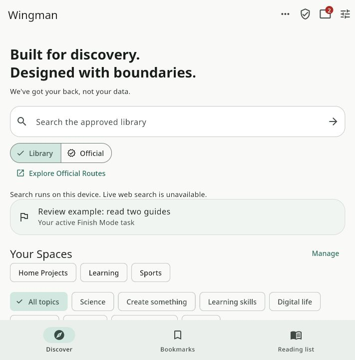
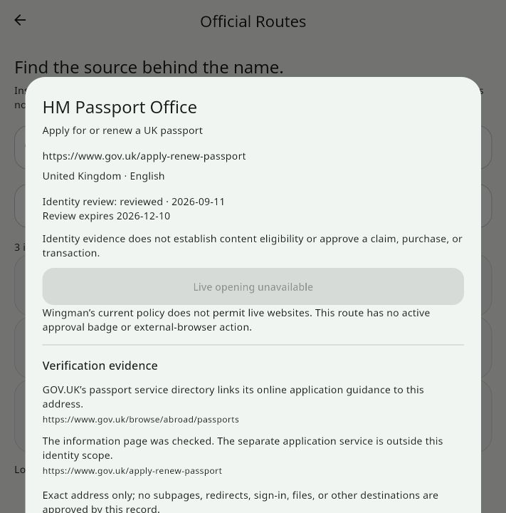
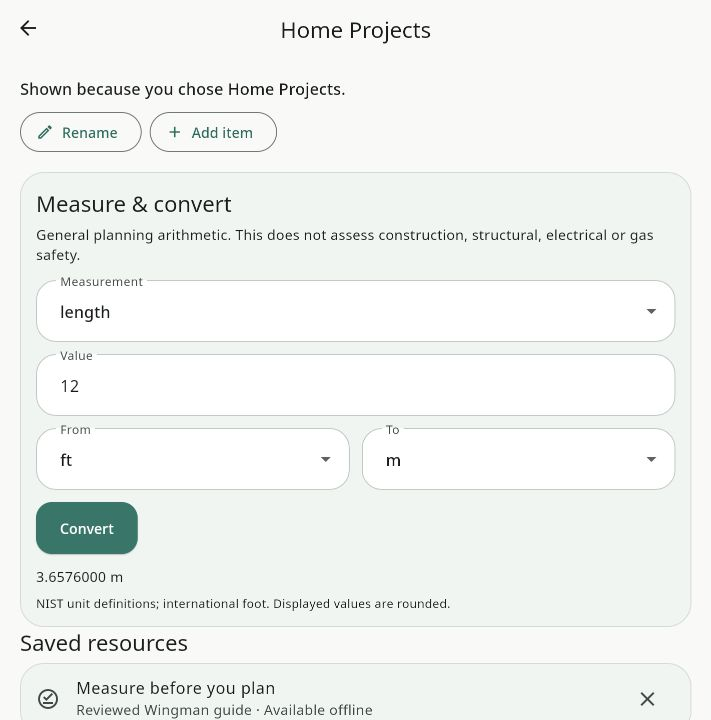
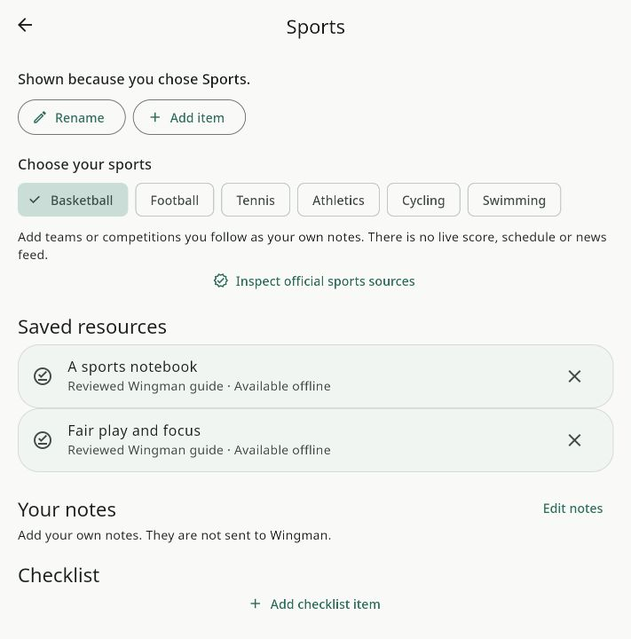
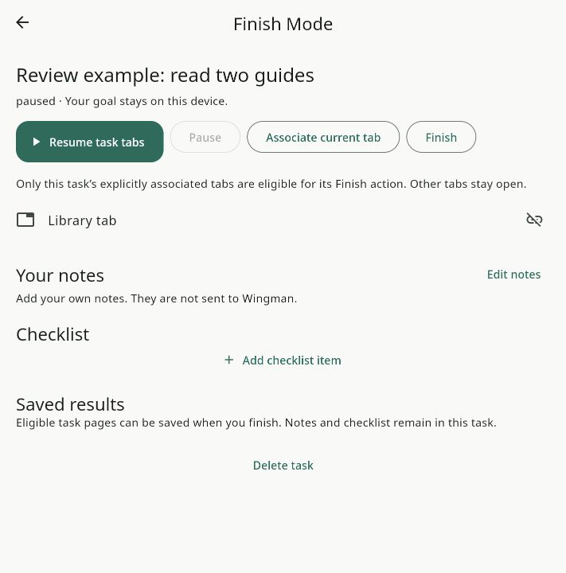
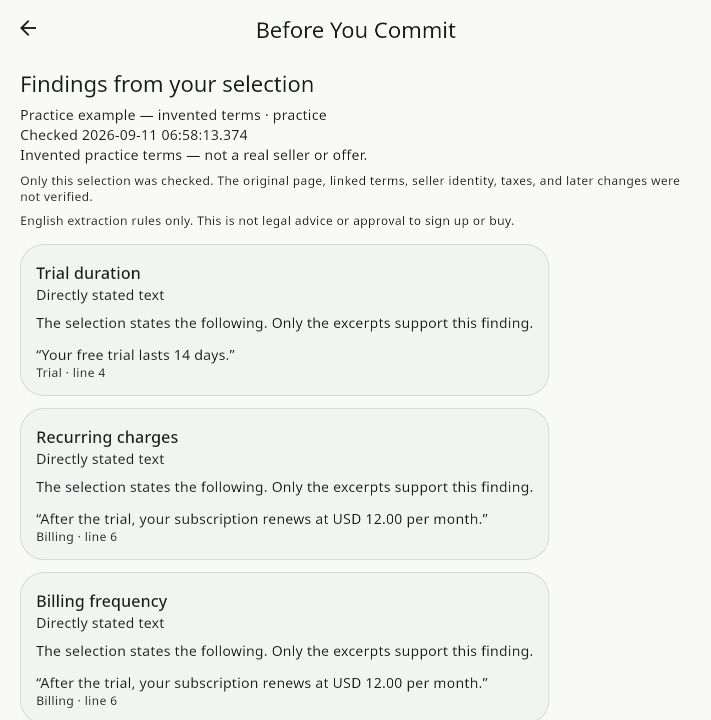
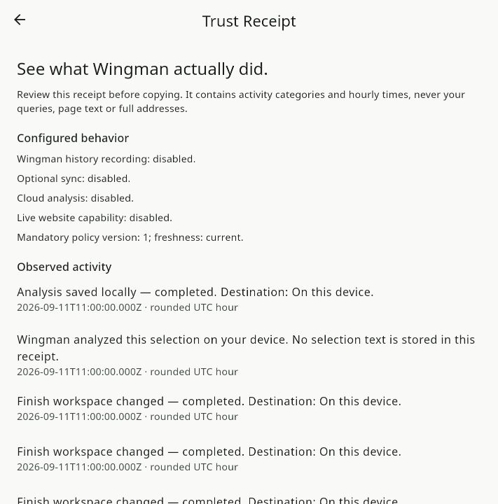
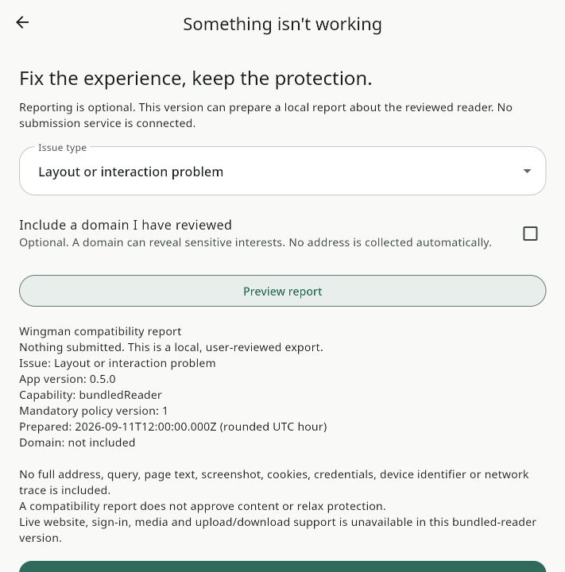

# Actual review screenshots

Captured from the compiled Flutter web companion on September 11, 2026 through the Codex in-app browser. These are implemented states, not design mockups. The Spaces, sport choice, task goal and practice analysis were explicitly created for this review. They are not bundled profiles or real merchant findings. Native Hand It Over is covered by separate Android/iOS runtime tests; the web companion cannot provide it.

## Home with explicit Spaces and an active review task

## Official identity evidence with live opening disabled

## Home Projects conversion: 12 feet to metres

## Sports from an explicit user choice

## Paused Finish task

## Before You Commit: invented practice terms, actual extracted evidence

## Trust Receipt from observed feature events

## Minimal compatibility report preview, without a domain

