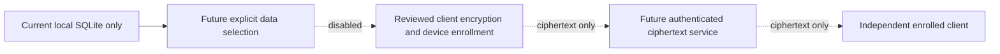

> Historical Phase 1–3A document. Optional Guard, live browsing, external search, Reader and ad behavior described here is superseded by [permanent protection 0.4](RELEASE_READINESS.md). It is not a current capability or release claim.

# Optional sync security gate

**Status: Deferred; sync and browser-based decryption are disabled pending protocol, provider and security review.** Milestone 3A adds local reading-list metadata and a local database migration. It does not implement encrypted sync, account sign-in, a cloud queue or a mock backend.

No Browser Firebase app, authentication endpoint, ciphertext store, deployed API or sync credential is configured. Authenticated local cloud tooling and similarly named projects do not establish approved Browser infrastructure. No resource is created or reused in 3A.

## Required 3D design and acceptance

The first future scope is bookmarks, reading-list metadata, selected nonsensitive preferences and separately enabled cross-device tabs. History, Guard choices, personal reminders and private tabs remain excluded. Account sign-in alone must not upload existing data.

Before implementation, select a maintained reviewed high-level encryption library and documented protocol. Define client authenticated encryption, device-bound key storage, verified enrollment, independent data recovery, rotation, record versions, conflict resolution and deletion tombstones. A short Family PIN cannot be the encryption key. Account recovery must not imply recovery of encrypted content without an enrolled device or recovery key.

The service must not hold plaintext decryption keys or a routine decryption mechanism. Server-accessible KMS, authentication and database access rules are not evidence of end-to-end encryption. Document service-visible account identifiers, timing, sizes and network metadata, including unavoidable provider logs.

Acceptance requires two independent clients, inspection that stored payloads contain ciphertext instead of titles/URLs, cross-account rejection, tamper/replay failure, offline conflict resolution and deletion that does not resurrect after an old client reconnects. Review plaintext exposure in queues, document identifiers, caches and logs. Test sign-out, device revocation, account/remote deletion, recovery and rotation. Revocation cannot guarantee erasure of content already obtained by a device.

If Firebase is chosen, use deny-by-default rules, ownership/schema limits, least privilege and emulator isolation tests; App Check supplements authorization. Do not add Analytics. Browser decryption remains gated on a separate review of delivered-code trust, XSS and key storage.

Dashed arrows describe requirements, not implemented connections. There is no independent audit, ciphertext exchange result or production deployment to report. Ordinary browsing and local Guard have no dependency on this future service.
