# Workspace and Handoff visual QA

This is a bounded source-and-widget-render review of S01–S05, T01–T03 and H01–H03. The screenshots are actual Flutter widget captures of signed bundled text and synthetic in-memory workspace state. They are not device screenshots, native app-switcher evidence or an accessibility certification.

The provided `Wingman_UI_Design_Handoff/reference-previews/spaces-light.png` and the current S01 render were inspected together, along with the handoff package’s HTML compositions and master prompt. The reference is illustrative, with synthetic website/task content; current runtime capability rules take precedence.

Two P2 differences were corrected in source after comparison: excessive hub card/header height hid the create action and selected Spaces, and an expanded converter displaced the Home Projects resources. The revised layout uses compact cards, a top Create a Space picker and an explicitly expanded measurement tool. The first Handoff render pass also exposed missing test icon-font loading and a shared app-bar font-family omission; corrected captures have proper type and icons. The task progress control’s invalid textual accessibility value was replaced with the framework’s numeric value plus a descriptive label.

The source corrections passed the full 402-test run (25 s, two optional benchmark skips), with clean analysis (2.4 s), and the refreshed S01 reference/current render was inspected together. All 22 H/S/T light/dark captures were inspected. No remaining P0–P2 issue was found within these captured states. Scroll reachability, 48-pixel minimum keypad targets and 200% reflow have separate widget tests; real assistive-technology announcements and mobile system keyboard behavior remain for native acceptance.

## Flow evidence

### 1. S01 — Create and organize Spaces

Create is now near the top; cards are compact and reorder targets remain separate.

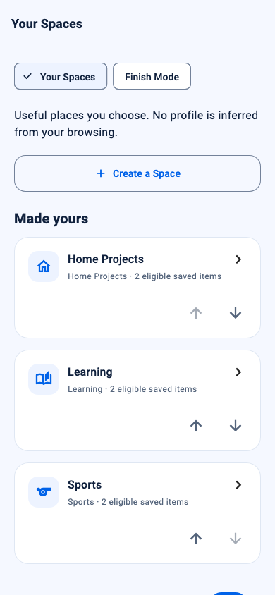

### 2. S02 — Customize a chosen template

The local editor has explicit Save/Cancel and bounded text. Custom arbitrary collection types remain unsupported.

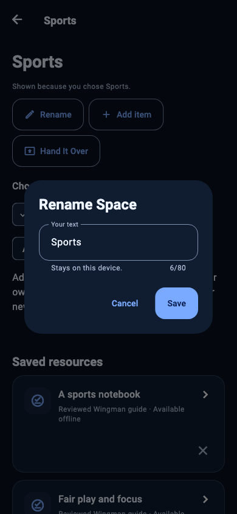

### 3. S03 — Home Projects

Saved guides remain visible; the converter opens only when selected.

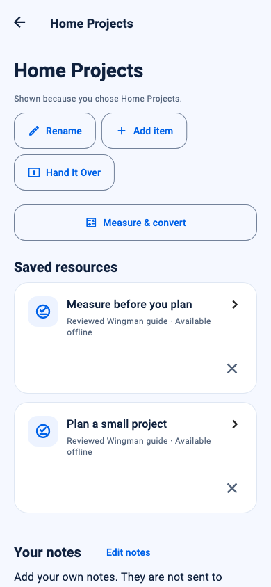

### 4. S04 — Learning

Topics are explicit choices and resource provenance is visible.

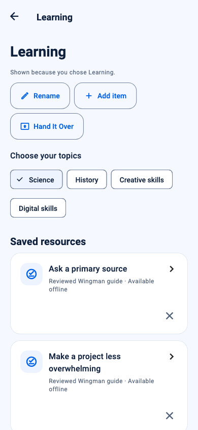

### 5. S05 — Sports

Chosen sports and official-source evidence are visible; no live score or betting claim.

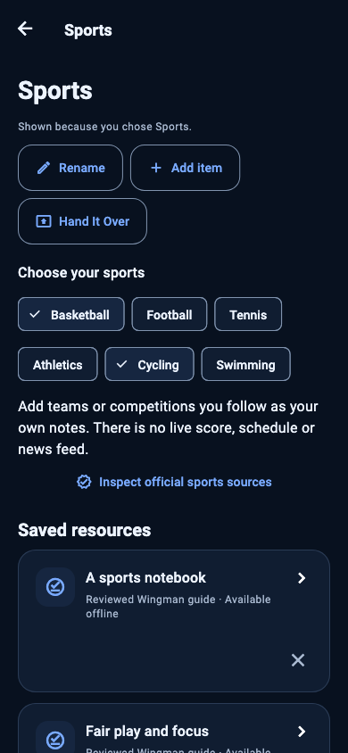

### 6. T01 — Choose or create a task

Real task status and a clear create action; no inferred productivity measure.

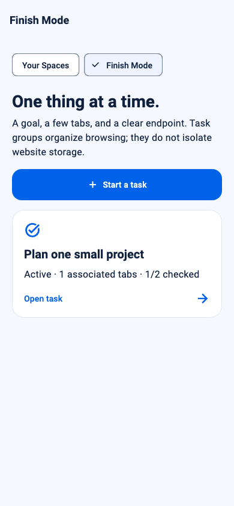

### 7. T02 — Work on the task

Progress comes from actual checklist items; associated-tab controls retain existing ownership callbacks.

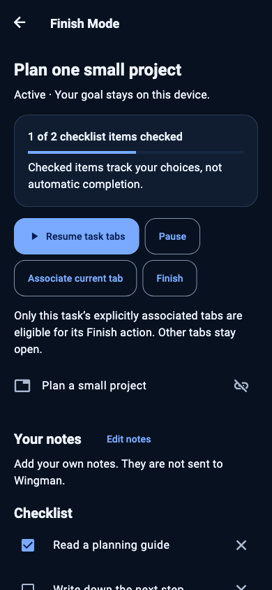

### 8. T03 — Finish and save

Save/close choices are explicit; no automatic close of unrelated tabs.

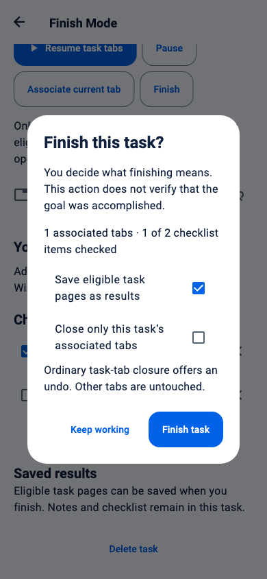

### 9. H01 — Preview what will be shared

Complete approved text is available by scrolling; static scope and return-code requirement are explicit.

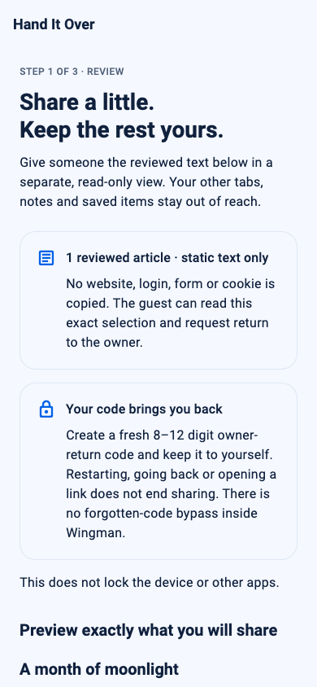

### 10. H02 — Read the shared view

Separate opaque guest surface, no owner controls or inputs; Return to owner remains visible.

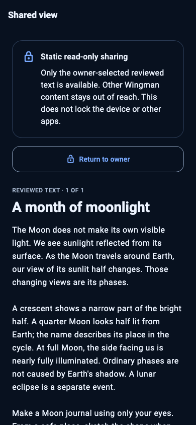

### 11. H03 — Authenticate owner return

Custom numeric keypad and full return action; no text-input or autofill session.

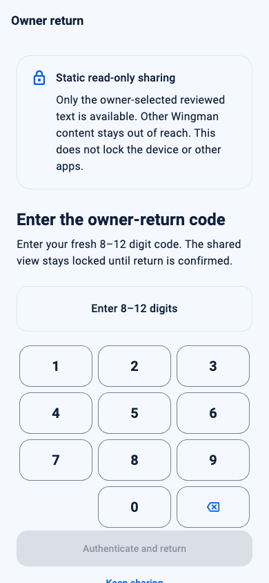

## Intentional capability differences

- Handoff shares pinned approved public text, not a fresh interactive website session. The owner-return code authenticates only return; it cannot relax permanent content policy. Web Handoff is unavailable in production. The tool gallery’s memory-only simulation is labeled and provides no device protection.
- Spaces use the three existing template kinds. Names, explicit choices, reviewed resources, notes and checklists are editable; an arbitrary custom collection/icon model is not invented.
- Sports has no licensed live feed. Finish Mode reports only actual checked items, saved IDs and associated tabs; it does not infer completion or isolate cookies.
- The guest intentionally does not use owner theme preferences. It follows platform brightness and keeps the separate root gate, persisted marker, retry/backoff and native incoming-link discard behavior.

Native launch assets are separately described in `native_brand.md`. Current source, both theme captures and responsive tests support the bounded UI findings here; they do not establish physical-device, OS credential or app-switcher timing guarantees.
